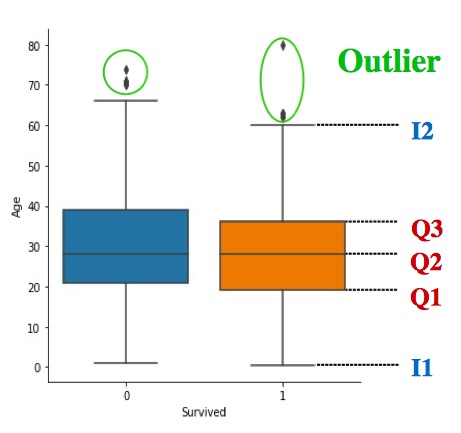

# Statistics

> 관심 또는 연구의 대상인 모집단의 특성을 파악하기 위해 모집단의 일부의 **자료(표본)를 수집하고**, 수집된 표본을 정리, 요약, 분석 하여 **표본의 특성을 파악한 후**, 표본의 특성을 이용해 **모집단의 특성**에 대해 추론하는 것

 

 

### Histogram vs Bar Plot

히스토그램은 수치자료 특히 연속자료의 분포형태를 표

히스토그램 vs 막대그래프 

* 구간이 같다면 차이가 없고, 구간이 다르다면 차이가 존재

계급의 상대도수를 사각형의 면적으로 표시  ⇒ 전체 면적 = 1

* 높이 = 상대도수/계급구간길이 = 밀도(density) 

 

### 수치자료의 대체중심위치

* 평균값
* 중앙값 : 순서통계량
* 절사평균값 : 오름 차순으로 data 정렬 후, 아래에서부터 k개 위에서부터 k개 제거 한 다음 남은 data로 평균
* 최빈값

 

### Box Plot(Viloin Plot)

**자료의 주요 위치 파악과 outlier 검출**

자료를 ascending하게 나열 한 뒤,

Q1 : 25%에 위치하는 data

Q2 : 50%에 위치하는 data

Q3 : 75%에 위치하는 data

IQR(Inter Quartile Range) = Q3 - Q1

* Inner Fence

* * I1 = Q1 - 1.5 * IQR
  * I2 = Q3 + 1.5 * IQR

Outlier : I1 ~ I2 바깥에 위치하는 data

* Outer Fence

  * O1 = Q1 - 3 * IQR

  * O2 = Q3 + 3 * IQR

Outlier : O1 ~ O2 바깥에 위치하는 data. 경우에 따라 Outer Fence를 기준으로 Outlier를 설정하기도 한다

 

### 표준화(Standardization)

표준화를 하면 절대 비교 가능

ex) 국어 원점수, 수학 원점수는 과목별 난이도가 다르기 때문에 절대비교 불가능하지만, 국어 표준점수, 수학 표준점수는 가능

표준화된 값(zi)의 평균은 0, 분산은 1, 표준편차는 1

 

### 변동계수 (Coefficient of Vaiation, CV)

변동계수 = 표준편차/평균

서로 다른 평균값을 가지는 경우 산포를 표준편차를 기준으로 하지 않고, 변동계수를 기준으로 하기도 한다

예를 들어 (3, 5, 12, 5, 8)라는 데이터 계열과 (15, 25, 60, 25, 40)라는 데이터 계열은 각각 3.14, 15.68이라는 표준편차를 가진다. 따라서 후자 쪽의 데이터가 편차가 큰 것 같이 보이지만 변동계수를 계산하면 양자는 0.475라는 같은 값을 갖는다

 

### 분포의 형태

https://rucrazia.tistory.com/65

https://support.minitab.com/ko-kr/minitab/18/help-and-how-to/statistics/basic-statistics/supporting-topics/data-concepts/how-skewness-and-kurtosis-affect-your-distribution/

Skewed 데이터를 변환하는 이유는 꼬리에 있는 값을 모델에 제대로 학습시키기 위함이다. Skewed 되어있는 값을 그대로 학습 시키면 꼬리 부분이 상대적으로 적고 멀어서 모델에 영향이 거의 없이 학습된다. 만약 꼬리부분도 노이즈가 아닌 정말 유의미한 데이터이면 꼬리부분에 해당하는 test 데이터는 예측력이 낮아진다.
변환을 해서 들어가게 되면 그만큼 데이터의 중간값(or 평균값)가 tail하고 가까워져서 모델에 보다 크게 들어간다. 그렇게 되면 꼬리쪽에 해당하는 test 데이터가 들어와도 예측력이 높아진다.

 

#### 왜도(Skewness)

자료가 대칭적으로 분포되어 있는지, 한쪽으로 기울어져 있는지

기울어져 있을 수록 outlier 존재 가능성 높다

피어슨(Karl Pearson) 제안

루트 b1이 0에 가까울 수록 대칭

 

#### 첨도(Kurtosis)

양쪽 꼬리가 얼마나 두터운지

양쪽 꼬리가 두터울 수록 outlier 존재 가능성 높다

피어슨(Karl Pearson) 제안

b2가 3에 가까울 수록 꼬리 적당

 

#### 정규성 검정

왜도 = 0, 첨도 = 3에 가까울 수록 정규분포에 가까움

Jqcque-Bera 검정

 

### Gasussian

### Laplasian

### 정규분포, 표준정규분포

### p value

http://www.databaser.net/moniwiki/wiki.php/%EC%9C%A0%EC%9D%98%ED%99%95%EB%A5%A0

 

### Bayesian Theorem, MLE, MAP

https://darkpgmr.tistory.com/62?category=761008

https://darkpgmr.tistory.com/119?category=761008

 

### 강의

http://www.kmooc.kr/courses/course-v1:SookmyungK+SM_sta_004k+2018_02SM_02/about

 

https://www.edwith.org/harvardprobability/joinLectures/17924

